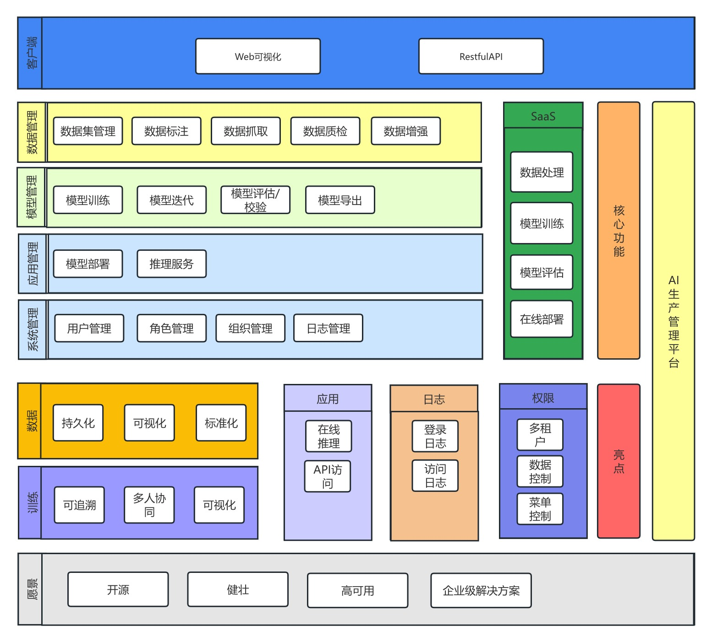
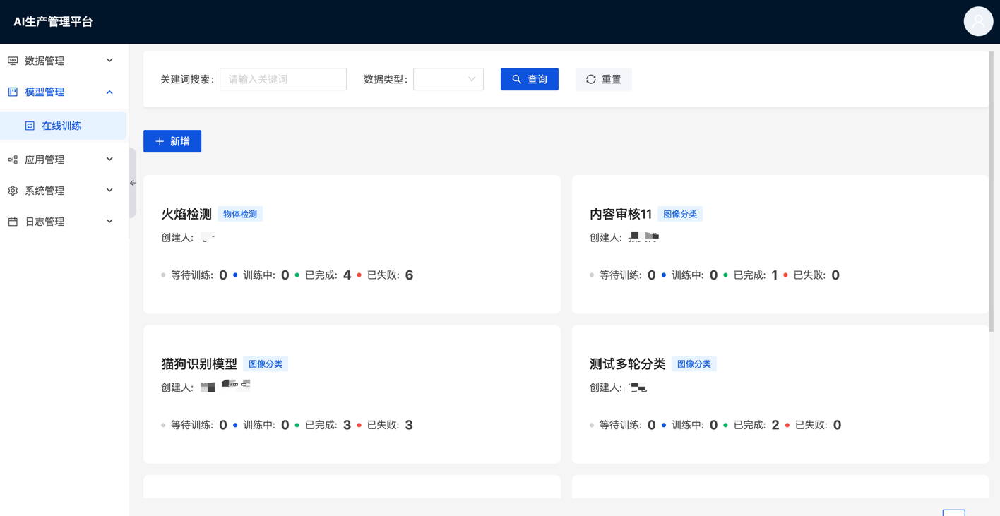
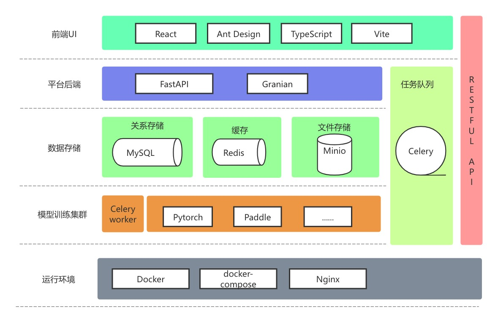

# 数安智能AI生产管理平台

数安智能是一家专注提供AI解决方案的科技公司,平台面向人工智能研究中的数据处理、算法开发、模型训练、算力管理和推理应用等各个流程的技术难点，研发了包括一站式算法开发平台、高性能分布式深度学习框架、先进算法模型库、视觉模型炼知平台、数据可视化分析平台等一系列平台及工具，在模型高效分布式训练、数据处理和可视分析、模型炼知和轻量化等技术上形成独特优势，目前已在产学研等各领域近千家单位及个人提供AI应用赋能

## 平台优势



## 页面预览



## 目录结构

```text
├── aibutler-backend            后端服务
├── aibutler-frontend           前端服务
├── deploy-predict              模型应用部署服务 
├── onnx-predict                模型推理服务
├── paddle-image-classify       基于paddlepaddle的图像分类模型训练服务
├── pytorch-object-detection    基于pytorch的目标检测模型训练服务
```

## 技术架构



## 功能介绍

数据管理：用户可以上传训练数据集并进行管理。如果要将原始数据集用于进行模型训练，可在平台上对所上传的数据集进行如图像分类、目标检测等类型的数据标注。
模型管理：使用标注完成的数据集进行模型训练，可在 CPU 或者 GPU 上进行多次反复迭代与参数调优训练，最终得到特定的结果模型。
应用管理：对模型管理中指定格式的模型进行部署，支持多种深度学习框架的模型,部署后可进行在线推理。

## GPU服务器单机部署

拉取项目代码进入项目目录

### 1. 修改配置文件

修改中间件环境变量
```chatinput
cp .env.example .env
# 修改.env文件中的mysql密码和minio账号密码
vi .env
```
修改aibutler-backend环境标识以及配置文件
```chatinput
# 修改标识为dev或prod
vi aibutler-backend/environment.py 
# 环境标识为dev时，使用.dev;环境标识为prod时, 使用.prod
cp .dev.example .dev
# 修改配置文件
```


### 2. 编译前端

### 3. 构建镜像

### 4. 启动项目
