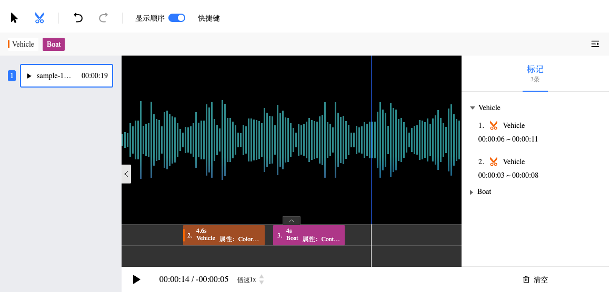

# @labelu/audio-annotator-react



音频标注和视频标注工具共用了大部分组件，所以它们的特性基本一致，差异主要在播放器上。

> - 音频标注内置了 [wavesurfer.js](https://github.com/katspaugh/wavesurfer.js)

**音视频标注工具支持以下特性：**

- 支持**片断分割**和**时间戳**标注
- 支持针对音频文件的**文本分类**和**文本描述**标注
- 支持快捷键标注和播放控制
- 支持标签属性编辑
- 支持侧边栏自定义
- 支持撤回和重做

如果你希望查看更详细的代码 API，请访问：[Audio Annotator API](https://opendatalab.github.io/labelU-Kit/interfaces/_labelu_audio_anntator_react.AnnotatorProps.html)

## 安装

[](https://www.npmjs.com/package/@labelu/audio-annotator-react)

```bash
npm install @labelu/audio-annotator-react
```

## 使用

### 在线示例 👇🏻

[](https://stackblitz.com/github/opendatalab/labelU-Kit/tree/website/packages/audio-annotator-react/example)

### 首先

你需要引入样式文件（这个样式文件主要包含 在 `@labelu/components-react` 中使用到的 [`rc-components`](http://react-component.github.io/badgeboard/) 的样式）：

```tsx
import '@labelu/audio-annotator-react/dist/style.css';
```

### 然后

你需要引入组件：

```tsx
import { Annotator } from '@labelu/audio-annotator-react';
```

### 最后

在应用中使用：

```tsx
import React from 'react';
import { useState } from 'react';

import { Annotator } from '@labelu/audio-annotator-react';
import '@labelu/audio-annotator-react/dist/style.css';

const samples = [
  {
    id: 'sample-12s',
    url: '/sample-15s.mp3',
    name: 'sample-12s.mp3',
    annotations: [
      {
        id: '1',
        start: 6.087957,
        end: 11.533612,
        label: 'vehicle',
        type: 'segment',
        order: 1,
      },
    ],
  },
];

const annotatorConfig = {
  // Global attributes, Available for segment and frame
  attributes: [
    {
      color: '#f8e8',
      key: 'Humanbeing',
      value: 'humanbeing',
    },
  ],
  segment: {
    type: 'segment',
    attributes: [
      {
        color: '#ff6600',
        key: 'Vehicle',
        value: 'vehicle',
        attributes: [
          {
            key: 'Color',
            value: 'color',
            type: 'string',
            maxLength: 1000,
            required: true,
            stringType: 'text' as const,
            defaultValue: '',
            regexp: '',
          },
          {
            key: 'Category',
            value: 'category',
            type: 'enum',
            required: true,
            options: [
              {
                key: 'Truck',
                value: 'truck',
              },
              {
                key: 'Mini Van',
                value: 'mini-van',
              },
              {
                key: 'Sedan',
                value: 'sedan',
              },
            ],
          },
        ],
      },
      {
        color: '#ae3688',
        key: 'Boat',
        value: 'boat',
        attributes: [
          {
            key: 'Contoury',
            value: 'contoury',
            type: 'enum',
            options: [
              {
                key: 'USA',
                value: 'usa',
              },
              {
                key: 'China',
                value: 'china',
              },
              {
                key: 'Japan',
                value: 'japan',
              },
            ],
          },
        ],
      },
    ],
  },
};

export default function App() {
  const [editType, setEditType] = useState('segment');

  return <Annotator samples={samples} type={editType} config={annotatorConfig} />;
}
```

## 配置

查看 [API](https://github.com/opendatalab/labelU-Kit/blob/main/packages/audio-annotator-react/src/context.ts#L13)

配置是针对四种标注类型而设定的，分别是：片断分割、时间戳、全局工具（文本分类、文本描述）。

### 片断分割和时间戳

```tsx
import React from 'react';
import { useState } from 'react';

import { Annotator } from '@labelu/audio-annotator-react';
import '@labelu/audio-annotator-react/dist/style.css';

export default function App() {
  const [samples, setSamples] = useState([
    {
      id: 'sample-12s',
      url: '/sample-15s.mp3',
      name: 'sample-12s.mp3',
      annotations: [
        {
          id: '1',
          start: 6.087957,
          end: 11.533612,
          label: 'vehicle',
          type: 'segment',
          order: 1,
        },
      ],
    },
  ]);

  const config = {
    segment: [{
      color: '#f8e8',
      key: 'Humanbeing',
      value: 'humanbeing',
      // Attribute for segment which without inner attributes
    },
    {
      color: '#ff6600',
      key: 'Vehicle',
      value: 'vehicle',
      // 👇🏻 Attribute for segment with inner attributes
      attributes: [
        {
          key: 'Color',
          value: 'color',
          type: 'string',
          maxLength: 1000,
          required: true,
          stringType: 'text' as const,
          defaultValue: '',
          regexp: '',
        },
        {
          key: 'Category',
          value: 'category',
          type: 'enum',
          required: true,
          options: [
            {
              key: 'Truck',
              value: 'truck',
            },
            {
              key: 'Mini Van',
              value: 'mini-van',
            },
            {
              key: 'Sedan',
              value: 'sedan',
            },
          ],
        },
      ],
    }]
    frame: {
      // 👆🏻 与片断分割配置定义相同
    }
  };

  return (
    <Annotator
      samples={samples}
      type="segment"
      config={config}
    />
  );
}
```

### 全局工具

查看 [API](https://github.com/opendatalab/labelU-Kit/blob/main/packages/interface/src/configuration/attribute/index.ts#L62)

```tsx
<Annotator
  samples={[]}
  type="segment"
  config={{
    // 标签分类
    tag: [
      {
        type: 'enum',
        key: 'Category',
        value: 'category',
        required: true,
        options: [
          {
            key: 'Humanbeing',
            value: 'humanbeing',
          },
          {
            key: 'Vehicle',
            value: 'vehicle',
          },
        ],
      },
    ],
    // 文本描述
    text: [
      {
        key: 'Description',
        value: 'description',
        type: 'string',
        maxLength: 1000,
        required: true,
        stringType: 'text' as const,
        defaultValue: 'Some default text',
        regexp: '',
      },
    ],
  }}
/>
```
